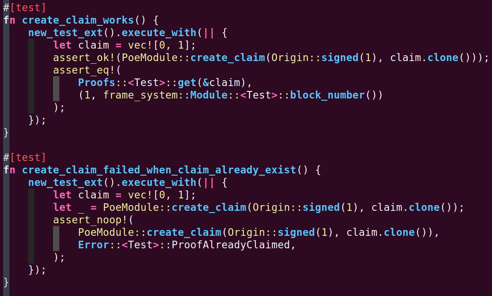
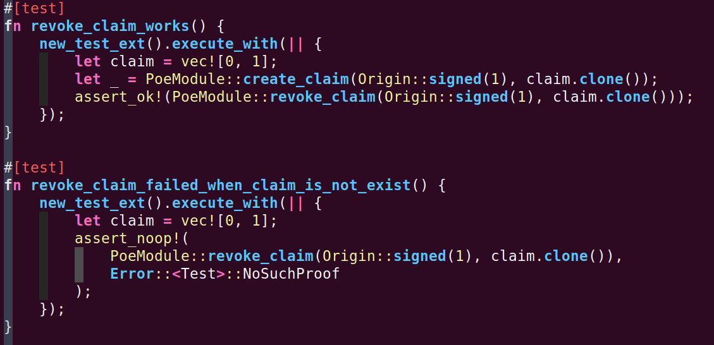
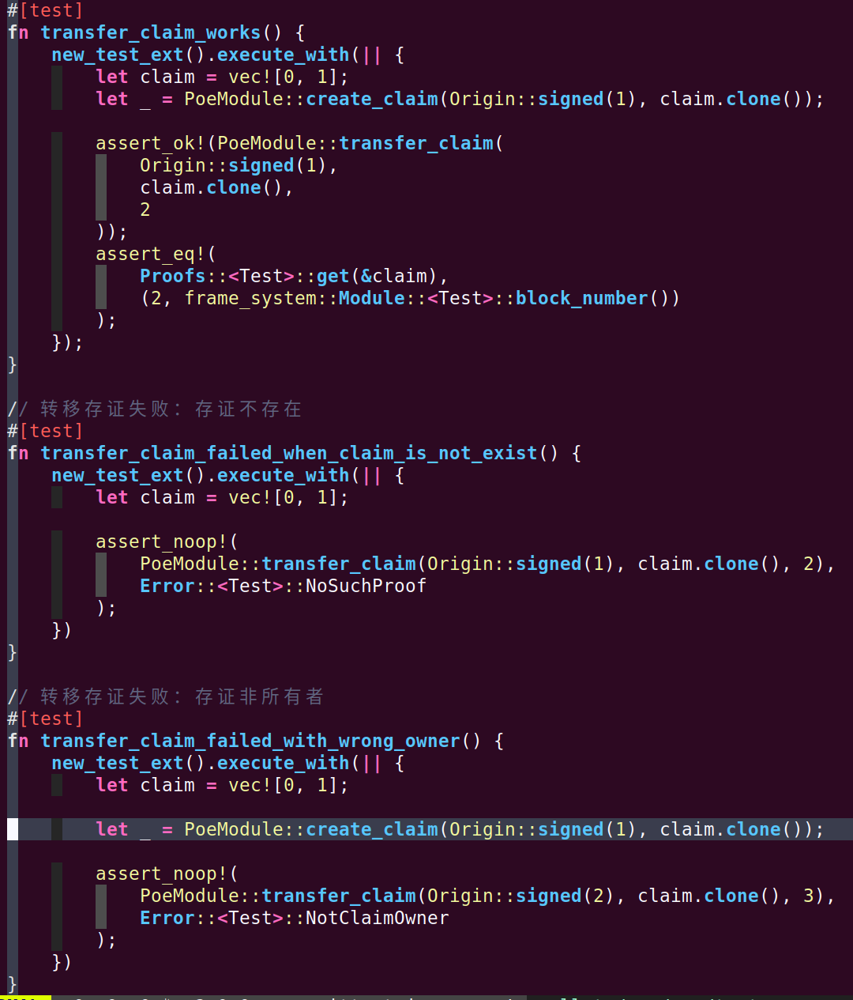
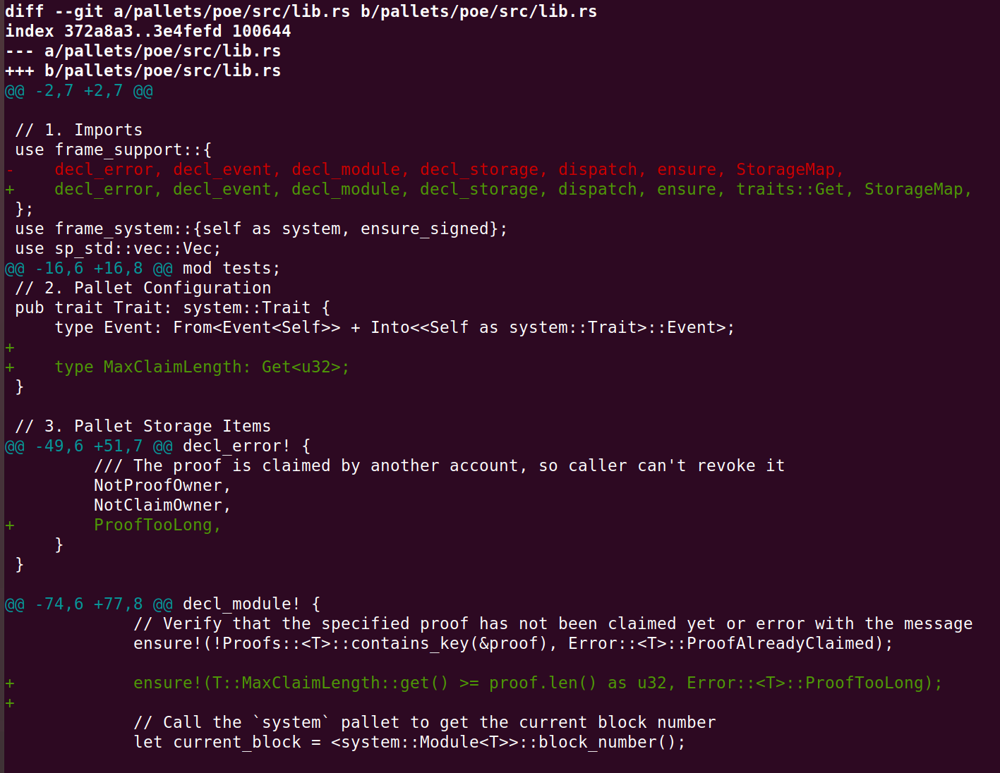
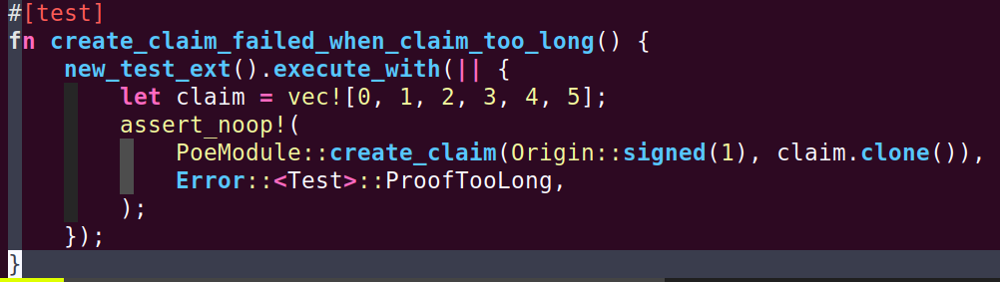
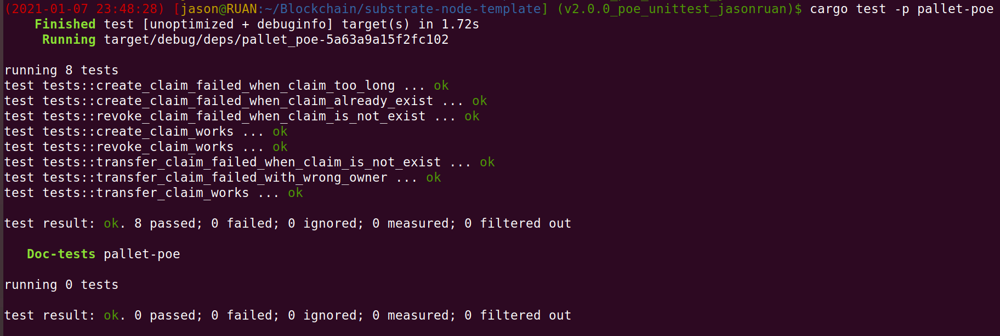

# Substrate进阶课【第一课作业】

*2021.01.07 jasonruan*

[TOC]

## 1 编写存证模块的单元测试代码

### 1.1 创建存证的测试用例

### 1.2 撤销存证的测试用例

### 1.3 转移存证的测试用例

## 2 创建存证时，为存证内容的哈希值 Vec

### 2.1 设置长度上限，超过限制时返回错误

### 2.2 并编写测试用例

## 3 单元测试执行情况

